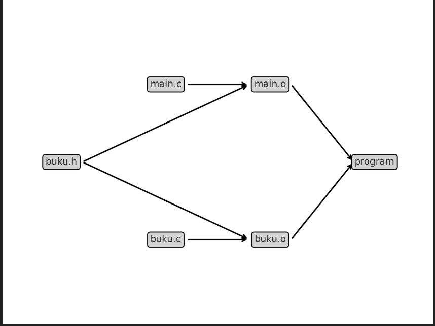

# 📚 Aplikasi Manajemen Buku Perpustakaan

Mini project ini adalah aplikasi sederhana berbasis **C** untuk mengelola data buku di perpustakaan.
Proyek ini cocok untuk pemula yang sudah mempelajari dasar-dasar C seperti **struct, array, file handling, modular programming, dan error handling**.

---

## ✨ Fitur

* Tambah buku baru (judul, penulis, tahun)
* Lihat daftar buku yang sudah tersimpan
* Simpan data buku ke file (`buku.txt`)
* Baca data buku dari file saat program dijalankan

---

## 📂 Struktur Folder

```
Library-System/
├── main.c        # Program utama (menu interaktif)
├── buku.c        # Implementasi fungsi manajemen buku
├── buku.h        # Header file (deklarasi struct & fungsi)
├── Makefile      # Untuk compile otomatis
└── buku.txt      # File penyimpanan data (akan dibuat saat program dijalankan)
```

---

## 🛠️ Cara Menjalankan

1. Clone atau salin folder project ke komputer Anda (Mac/Linux).
2. Masuk ke folder project:

   ```bash
   cd project
   ```
3. Compile program dengan `make`:

   ```bash
   make
   ```
4. Jalankan program:

   ```bash
   ./program
   ```

Gambaran diagram alur build dari Makefile-mu:



* `main.c` + `buku.h` → dikompilasi jadi `main.o`
* `buku.c` + `buku.h` → dikompilasi jadi `buku.o`
* `main.o` + `buku.o` → di-linking → menghasilkan executable `program`

Kalau kamu jalankan `make clean`, semua `.o` dan `program` akan dihapus, jadi project bisa dibangun ulang dari nol.

---

## 📖 Contoh Penggunaan

```
=== Menu Perpustakaan ===
1. Tambah Buku
2. Tampilkan Buku
3. Simpan ke File
0. Keluar
Pilih: 1
Masukkan judul: C Programming
Masukkan penulis: Kernighan & Ritchie
Masukkan tahun: 1988
Buku berhasil ditambahkan!

Pilih: 2
=== Daftar Buku ===
1. C Programming | Kernighan & Ritchie | 1988
===================
```

---

## 🔮 Langkah Selanjutnya

Proyek ini bisa dikembangkan lebih lanjut agar lebih mendekati aplikasi nyata:

1. **Fitur Hapus Buku**

   * Admin bisa menghapus buku berdasarkan ID.
   * Data di array dan file ikut diperbarui.

2. **Fitur Update Buku**

   * Ubah informasi buku (judul, penulis, tahun).

3. **Fitur Cari Buku**

   * Cari buku berdasarkan judul atau penulis.

4. **Validasi Input**

   * Pastikan tahun > 0, judul tidak kosong, dll.

5. **Manajemen Lebih Kompleks**

   * Tambahkan kategori buku, status dipinjam/tersedia.
   * Buat sistem login sederhana untuk admin & user.

6. **Penyimpanan Lebih Rapi**

   * Gunakan format binary (`.dat`) bukan hanya text file.
   * Atau gunakan database (misalnya SQLite) setelah paham dasar C.

---

## 🎯 Tujuan Pembelajaran

Dengan menyelesaikan proyek ini, peserta akan:

* Menguasai **struct dan array** untuk menyimpan data.
* Memahami **file handling** untuk data persisten.
* Terbiasa dengan **modular programming** (`.c` + `.h`).
* Belajar **error handling** dalam kasus nyata.
* Siap melangkah ke proyek C yang lebih besar.
